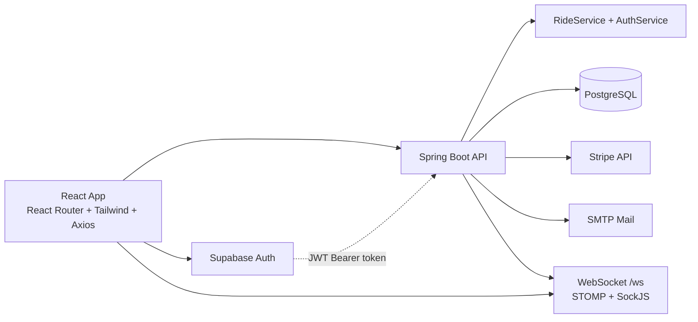

# RideWithMe

<p align="center">
  <strong>Full-stack ridesharing platform with role-based workflows, payments, and live ride updates.</strong>
</p>

<p align="center">
  
  
  
  
  
  
</p>

---

## Overview

RideWithMe is a role-aware ridesharing app where drivers publish rides and manage requests while riders search, request seats, and pay after approval.

The project is split into a React frontend and a Spring Boot backend with PostgreSQL, Supabase-authenticated API access, Stripe payment intents, and STOMP/SockJS ride updates.

## Core Features

- Role-based user paths: `RIDER`, `DRIVER`, and admin flows.
- Driver ride management: create rides, approve/reject participants, start/complete rides.
- Rider booking flow: search rides, join rides, track booking status, pay to confirm seat.
- Payment integration: Stripe PaymentIntent API plus in-app payment modal.
- Real-time updates: backend publishes GPS-like updates to `/topic/ride/{rideId}` and frontend subscribes via STOMP.
- Profile and onboarding flows including multi-step registration and document upload endpoints.
- Email notifications for approvals and booking events via SMTP.

## Role Matrix

| Role | Main Actions |
|---|---|
| Rider | Search rides, join rides, pay for approved bookings, track bookings |
| Driver | Create rides, review riders, approve/reject participants, update ride status |
| Admin | Review pending users, approve/reject users, trigger approval email |

## Architecture



## Repository Layout

```text
RideWithMe/
|- frontend/                  # React 18 app (pages, components, API client)
|- backend/                   # Spring Boot app (controllers, services, repositories)
|- github_secrets/            # Local env/property files used by start scripts
|- scripts/                   # Utility scripts and schema helpers
|- logs/                      # Runtime/debug logs
|- .env                       # Optional imported backend config
```

## API Highlights

| Area | Endpoint Examples |
|---|---|
| Auth | `POST /api/auth/sync`, `POST /api/auth/register`, `GET /api/auth/me` |
| Rides | `GET /api/rides/search`, `GET /api/rides/my-rides`, `POST /api/rides/{id}/join` |
| Driver actions | `POST /api/rides/{rideId}/participants/{participantId}/approve`, `PATCH /api/rides/{id}/status` |
| Payments | `POST /api/payments/create-intent`, `POST /api/rides/{rideId}/participants/{participantId}/confirm-payment` |
| Realtime | `POST /api/ride-realtime/publish`, WebSocket topic `/topic/ride/{rideId}` |
| Files | `POST /api/files/upload`, `GET /api/files/download/{fileName}` |
| Admin | `GET /api/admin/pending-users`, `POST /api/admin/users/{id}/approve` |

## Getting Started

### Prerequisites

- Node.js 18+ and npm
- Java 17
- Maven Wrapper (already included as `mvnw`/`mvnw.cmd`)
- PostgreSQL reachable from backend configuration

### 1) Configure secrets

This repo expects local config files used by startup scripts:

- `github_secrets/frontend.env`
- `github_secrets/application.properties`
- Optional: root `.env` (backend also imports this)

Frontend env keys used in code:

- `REACT_APP_STRIPE_PUBLISHABLE_KEY`
- `REACT_APP_TILE_URL`
- `REACT_APP_WS_URL`

Backend properties consumed in code include:

- `supabase.jwt.secret`
- `stripe.secret.key`
- `spring.mail.username` (and related SMTP settings)
- datasource properties (`spring.datasource.*`)

### 2) Run backend

```bash
cd backend
# Windows
.\\mvnw.cmd spring-boot:run
# macOS/Linux
./mvnw spring-boot:run
```

Backend default URL: `http://localhost:8080`

### 3) Run frontend

```bash
cd frontend
npm install
npm start
```

Frontend default URL: `http://localhost:3000`

## Development Commands

### Frontend

```bash
npm start
npm run build
npm test
```

### Backend

```bash
./mvnw test
./mvnw package
```

## Notes for Contributors

- Current security config is permissive for development (CORS and some public endpoints).
- Realtime transport is configured with SockJS endpoint `/ws` and broker topic prefix `/topic`.
- If you rotate credentials, update local secret files instead of hardcoding values.
